## INTRODUCTION
This project entails comprehensive analysis of consumer electronic gadgets and accessories sales, the project showcases one’s ability to manipulate and derive actionable insights from large datasets, enabling us to make data-driven recommendations for optimizing sales strategies.
## DATA OVERVIEW
Dataset was obtained from Meri SKILL. The dataset consists of sales of electronic gadgets and accessories, from January 2019 to December 2019, consists of 19 different products, with total number of 11 columns and 185,950 rows. Data was modified for further analysis.

I used Power Bi tool to carry out the exploratory data analysis and visualization.

## BUSINESS OBJECTIVE
Our primary goal is to extract actionable information from a substantial dataset, providing a roadmap for optimizing sales strategies and achieving sustainable growth.

In other to achieve these goals, The following important key questions were answered:

**1.What is the overall sales trend?**

**2.Top selling products with the total revenue generated?** 

**3.Which products have the highest/least quantity ordered?**

**4.What’s the relationship between the price of a product and the quantity ordered?**

**5.Cities with highest sales in terms of total revenue generated?**

## DATA CLEANING AND PREPROCESSING
The following tasks were performed on the datasets to ensure accuracy and consistency, it involves intensive data cleaning like checking for missing values, standardizing data types, renaming columns, creating new columns from existing columns, and creating a unified format for analysis.

Calculated metrices like total revenue, profit margin, sales quantity, using new calculated columns and measures using Data Analysis Expressions (DAX):

#### STEP1
I downloaded the dataset, uploaded it using ‘GET DATA’ option in Power Bi and then proceeded to transform the data using ‘Power Query Editor’.

**Table1**
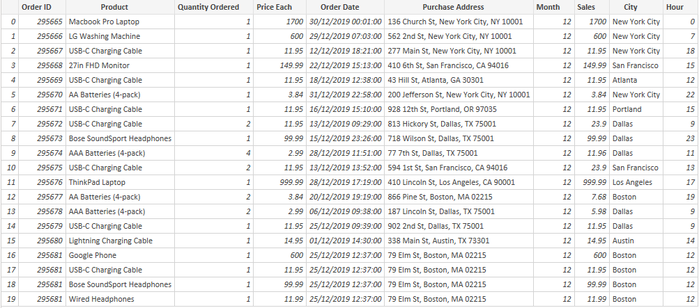
   main dataset
   
**Table2**
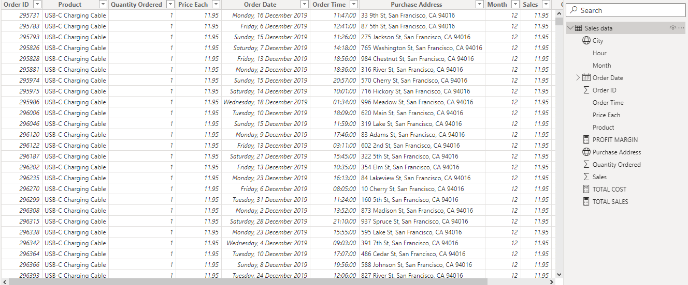
   cleaned dataset
#### STEP2
The column headers were identified. you do so by navigating to ‘Transform tab’ and select ‘Detect Data Type.’ This action will automatically identify the data type of each column and convert them as needed.

#### STEP3
Split the datetime column into date and time stamp and renamed the columns.

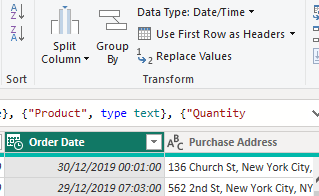   &#8594;   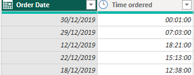 

- Selected the desired column. Following the selection, the option of split the column becomes visible.
- Choose the ‘Split Column’ option and space as the delimiter.
- Upon completing the data transformation, click on ‘Close & Apply’ located at the top left.

  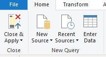

#### STEP4
To find Revenue metrices:
- Revenue = 34.49M (sum up the net profit from all sales transaction)
Select the “Card” visualization type, then drag and drop the “Sales” into the designated field. Convert it to the “SUM” aggregation.

Additionally, adjust the display units to show values in millions, billions, trillions, thousands, or hundreds, and customize the number of decimal places as needed.

- Profit Margin = 58.83% (((TOTAL SALES -TOTAL COST)/TOTAL SALES) *100), using Data Analysis Expression (DAX) first calculate 'Total Cost' and 'Total Sales', then convert to percentage.
Click on “New Measure” to calculate the following;

Find “Total Cost” using new measures;

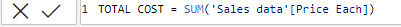

Find “Total Sales” using new measures;

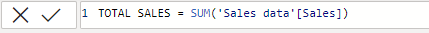

Find “Profit Margin” using new measures

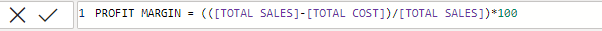

- Sales Quantity = 209K (‘SUM’ the total number of units sold)

## ANALYSIS & INSIGHTS
**1.What is the overall sales trend?**

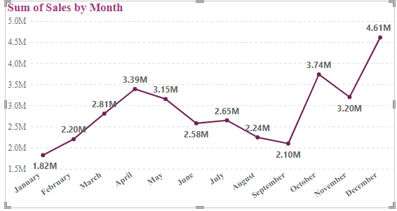

- The data shows that sales are highest in December with over 4.61M total revenue generated, and about 13.8% contribution to the total revenue generated. January, on the other hand had lowest performing month with just over 5.28 % contribution to the total revenue generated and total sales of 1.82M.
- This suggests that sales tend to be low at the beginning of the year, and high at the end of the year.
- The trend also shows a seasonal fluctuation.

**2.Top selling products with the total revenue generated?**

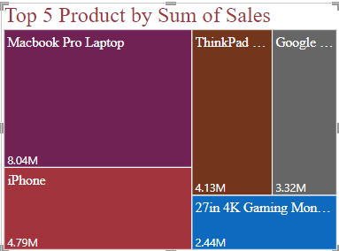

Top selling product with the total revenue generated, which was filtered down to top 5 were Macbook Pro Laptop, iPhone, ThinkPad Laptop, Google Phone and 27in 4k Gaming Monitor.
Insights on why some products generate more revenue than others;
- One reason could be that the higher-revenue products have a higher price point.
- Another reason could be that products generating higher revenue have a wider distribution channel, making them more accessible to people.
- Another factor could be that products with higher revenue are simply better products offering more value to consumer.
- A times least generating revenue products might have this market strategies, just that it might be the case of the product’s features not aligning with the needs of the target market or simply that the product is too similar to competing products on the market.
- It could be that the higher generating revenue products has a strong brand reputation, making them more desirable to consumers.

**3.Which products have the highest/least quantity ordered?**

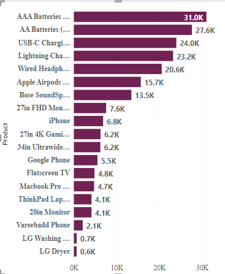

The most ordered product is AAA Batteries with about 31,017 units sold while LG Dryer has the least quantity of order with about 646 units sold.
There are different factors that can impact how well a product sell, such as;
- Price point: if a product is priced too high, it may not sell well. Conversely, if it’s priced too low, it may not be perceived as high-quality.
- Target market: if a product is marketed to the wrong audience, it may not sell well.
- Product positioning: how a product is positioned in the market can impact its sales. For example, if a product is positioned a luxury item, it may sell better to a certain demographic than if it’s positioned as a budget item.
- Product features: if a product doesn’t have the features that customers are looking for, it may not sell well.
- Distribution channel: another factor can be products distribution channel. If it’s sold through the wrong channel, it may not reach its target market.

**4.What’s the relationship between the price of a product and the quantity ordered?**

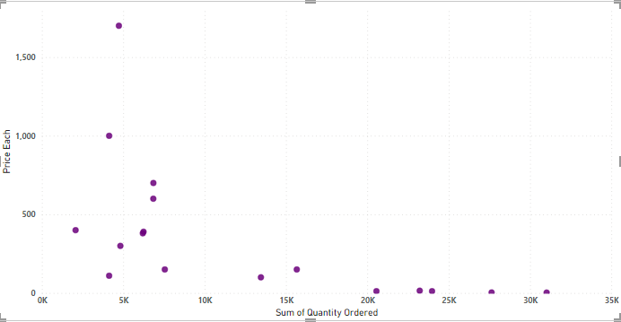

From the scatterplot it shows that there is a negative correlation between price and quantity demanded. Meaning that as one variable increases, the other decreases. This is because, all things being equal, consumers are less likely to buy a product when the price is higher or this could be as a result of some underlying factors.

**5.Cities with highest sales in terms of total revenue generated?**

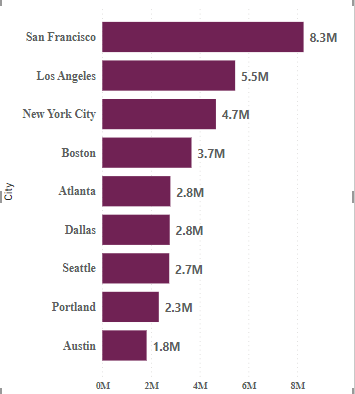

- Our dataset shows that San Francisco has the highest sales, followed by Los Angeles, Boston, New York City and Atlanta as categorized as top 5 cities with highest revenue generated.
- From above analysis, it’s clear that there is significant difference in order frequency across different cities, with San Francisco having highest number of total sales and Austin having the lowest sales. This could be due to a number of factors, including population size, demographics, and economic conditions.
- These findings highlight the importance of considering location specific factors when analyzing customer data.

## RECOMMENDATIONS
1. Effective measures should be taken to know the cause of sales seasonal fluctuations.
2. For product generating the most revenue, I recommend company should utilize product bundling and upselling strategies to increase sales. For example, offer a discount when customers buy multiple items together.
3. Company should invest in product marketing and advertisement, to increase brand awareness and drive sales. This could be digital marketing, social media campaigns, and traditional advertising.
4. Company should keep an adequate inventory of top selling products to avoid being out of stock.
5. Utilizing customer feedback to improve the products and make them more appealing to customers for sales optimization.
6. Providing excellent customer service to create a positive customer experience and encourage repeat purchases.
7. To increase sales in location generating low sales, it’s important to understand the local market and what makes it unique. By exploring the competition, current market efforts and customer needs.
8. A tailored strategy can be developed by offering promotions or incentives to attract new customers and increases sales.

#### full visualization
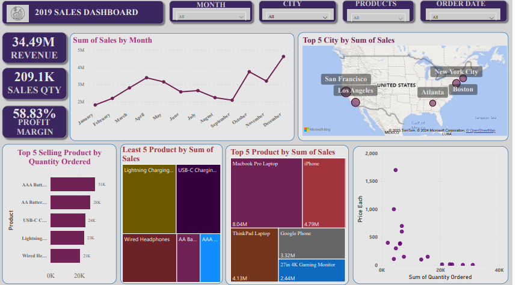
